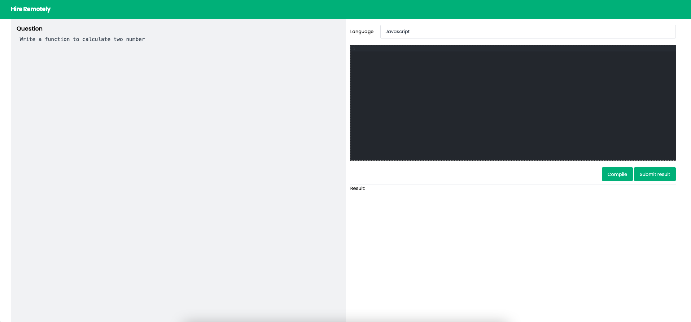

## 🧐 About <a name = "about"></a>



Online Code Editor
### Prerequisites

- option 1: docker and docker-compose must be installed
- option 2: if you dont want to use docker compose, then node with version `16.3.0` must be installed

```
docker-compose up
```
## ⛏️ Built Using <a name = "built_using"></a>

- [NextJS](https://nextjs.org/) - Reactjs Framework
- [NodeJs](https://nodejs.org/en/) - Server Environment
- [Docker](https://docker.com)- Develoment/Production Environment
